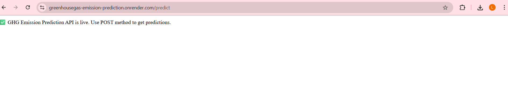
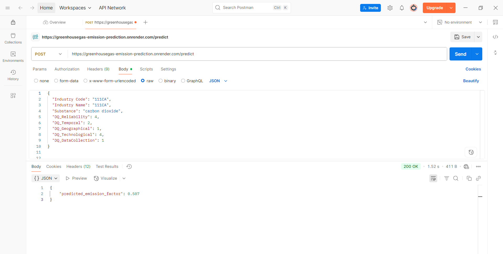
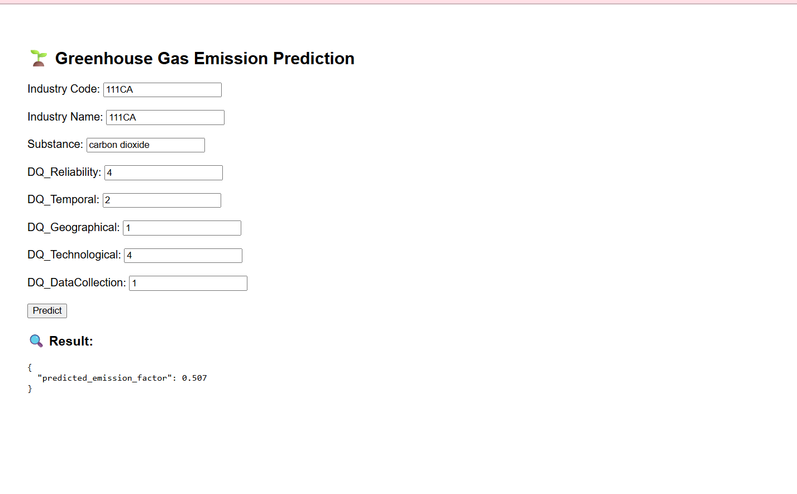

# 🌱 Greenhouse Gas Emission Prediction API

This project predicts greenhouse gas (GHG) emission factors using a machine learning model deployed as a Flask web API.

## 📌 Project Overview

This project was developed as part of the Shell Edunet Internship program. It uses industry and substance data with quality indicators to predict the emission factor using a trained regression model.

## 🚀 Live Demo

🌐 **API Endpoint:**  
[https://greenhousegas-emission-prediction.onrender.com/predict](https://greenhousegas-emission-prediction.onrender.com/predict)

Use tools like Postman or the provided HTML form to test it.

---

## 🛠 Tools and Technologies Used

- **Language:** Python
- **Libraries:** pandas, numpy, scikit-learn, joblib, openpyxl
- **Web Framework:** Flask + flask-cors
- **Deployment:** Render (Free Cloud Hosting)
- **API Testing:** Postman

---

## 🔧 How to Run Locally

### 1. Clone the repository:
```bash
git clone https://github.com/magadumlaxmi/GreenhouseGas-emission-prediction.git
cd GreenhouseGas-emission-prediction
```

### 2. Create virtual environment (optional but recommended):
```bash
python -m venv venv
source venv/bin/activate  # or venv\Scripts\activate on Windows
```

### 3. Install dependencies:
```bash
pip install -r requirements.txt
```

### 4. Run the Flask app:
```bash
python app.py
```

---

## 📬 API Usage

### Endpoint:
```
POST /predict
```

### Request Body:
```json
{
  "Industry Code": "111CA",
  "Industry Name": "111CA",
  "Substance": "carbon dioxide",
  "DQ_Reliability": 4,
  "DQ_Temporal": 2,
  "DQ_Geographical": 1,
  "DQ_Technological": 4,
  "DQ_DataCollection": 1
}
```

### Response:
```json
{
  "predicted_emission_factor": 0.507
}
```

---

## 💡 Features

- CORS enabled for browser-based interaction
- Trained Linear Regression model
- Real-time predictions
- Deployed and publicly accessible API
- HTML test form included

---

## 🖼 Screenshot 
### 🔹 Render Live Deployment


### 🔹 Postman Prediction Output


### 🔹 Browser Form Prediction


---

## 👤 Author

**Laxmi Magadum**  
Final-year CSBS student  
Shell Edunet Intern – 2025

